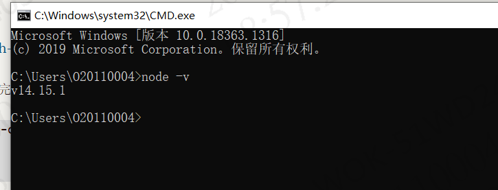
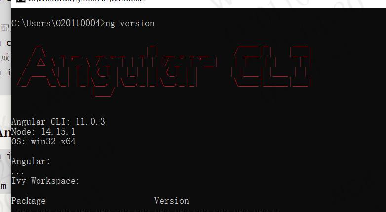

<center style="color:green;font-size:50px">Angular</center>

# 一，安装脚手架

## 1，安装node.js

node.js官网：https://nodejs.org/zh-cn/

根据自己系统下载相应版本，下载完成以后，下一步-->下一步--> ....安装完毕；

```
https://nodejs.org/zh-cn/

node -v 查看版本号
```


打开命令行工具，输入node -v 检查版本号，如下安装成功



## 2，安装淘宝镜像

```
npm install -g cnpm --registry=https://registry.npm.taobao.org
```

```
设置使用淘宝镜像
npm config set registry https://registry.npm.taobao.org
 
// 配置后可通过下面方式来验证是否成功
npm config get registry
// 或
npm info express

```

## 3，安装Angular脚手架

```
npm install -g @angular/cli 
或
cnpm install -g @angular/cli 
```

查看是否安装成功

```
ng  version
```



## 4，卸载命令

如安装失败需要卸载重新执行上面的安装命令

```

npm uninstall –g angular-cli
或
cnpm uninstall –g angular-cli
```

# 二，命令

## 1，创建项目

ng  new 项目名     创建项目

npm install  或  cnpm install      初始化项目

ng serve  编译运行项目(启动项目)

更改端口号  ： ng  serve --port 4201

http://localhost:4200/    项目访问路径

## 2,常用命令

1. 查看angular-cli的版本号：`ng -v`
2. 创建项目：`ng new app(项目名称)`
3. 下载依赖包：`npm install`
4. 删除依赖包：
   - `npm install rimraf -g`
   - `rimraf node_modules`
5. 创建组件：`ng g c MyComponent(组件名称)`

```
	// 创建组件的时候也可以带路径，比如：ng generate component mydir/MyComponent（从app下的文件夹开始写）  如：
   app下建组件demo就 
   ng   g component demo
   demo下建组件news就 
   ng   g component /demo/news
```

1. 创建service服务 ：`ng g s MyService`
2. 动态生成服务，并把这个服务提供给依赖注入系统: ·ng g service 服务名 --module=app·
3. 动态生成类文件: `ng g class 类名`
4. 动态生成接口文件: `ng g i 接口名`
5. 创建module : `ng g m teacher`
6. 动态生成管道，并把这个管道在module中声明： `ng g p 管道名`
7. 新建路由文件: `ng g module trade --routing`
   10.动态生成组件，并把这个组件导入module中: `ng g c 组件名`
8. 不生成对应的单元测试文件: `ng g c core/header --spec false`
9. 创建guard（一般用于写权限拦截）: `ng g g service/login/login`
10. 自动创建指令：`ng g d MyDirective`
11. 运行项目： `ng serve`
12. 停止项目：`ctrl +c 输入y`
13. 构建项目：`ng build`
14. 如果你想构建最终的产品版本（进行优化，包压缩等），可以用 `ng build –prod`
15. 添加路由： `ng generate module app-routing --flat --module=app`

# 三，指令

1，ngIf

ngFor

ngSwitch

ngStyle

ngClass

ngNonBindable    让ng失效

ngModel


