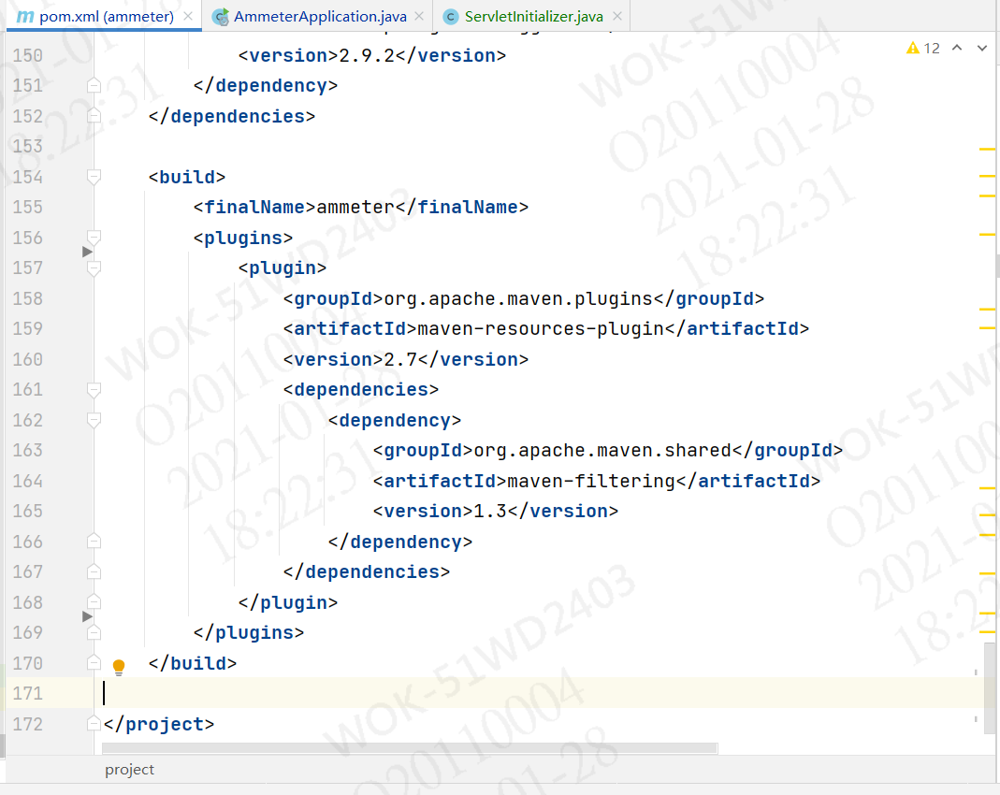
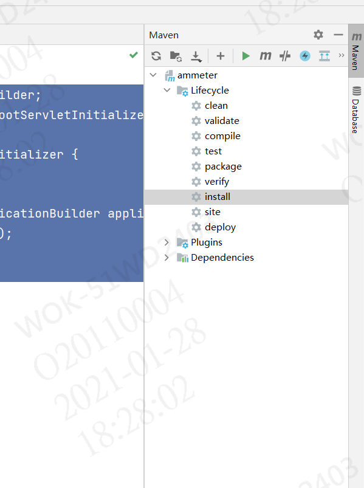

<center style="font-size:50px; color:green;">Idea打包maven项目</center>

## 1,导入依赖

在pom.xml中加入以下代码



```
 <build>
        <finalName>ammeter</finalName>
        <plugins>
            <plugin>
                <groupId>org.apache.maven.plugins</groupId>
                <artifactId>maven-resources-plugin</artifactId>
                <version>2.7</version>
                <dependencies>
                    <dependency>
                        <groupId>org.apache.maven.shared</groupId>
                        <artifactId>maven-filtering</artifactId>
                        <version>1.3</version>
                    </dependency>
                </dependencies>
            </plugin>
        </plugins>
    </build>
```

加入依赖包排除自带tomcat

```
    <dependency>
            <groupId>org.springframework.boot</groupId>
            <artifactId>spring-boot-starter-tomcat</artifactId>
            <scope>provided</scope>
        </dependency>
```

## 2，启动类继承SpringBootServletInitializer

```
@SpringBootApplication
public class AmmeterApplication extends SpringBootServletInitializer {
     public static void main(String[] args) {
         SpringApplication.run(AmmeterApplication.class,args);
     }
    @Override
    protected SpringApplicationBuilder configure(SpringApplicationBuilder builder) {
        return builder.sources(AmmeterApplication.class);
    }

}
```

## 3，新建ServletInitializer类

与启动类放在同一级

```
import org.springframework.boot.builder.SpringApplicationBuilder;
import org.springframework.boot.web.servlet.support.SpringBootServletInitializer;

public class ServletInitializer extends SpringBootServletInitializer {

    @Override
    protected SpringApplicationBuilder configure(SpringApplicationBuilder application) {
        return application.sources(AmmeterApplication.class);
    }

}
```

## 4，clean   and   install

