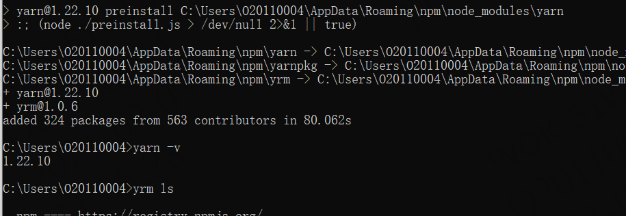
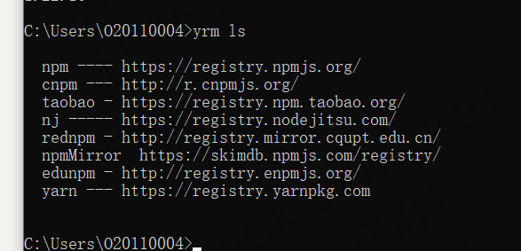

# npm

### 1,设置镜像

npm config set registry  http://10.66.20.189:4001/repository/npm-group/

### 2，安装管理镜像工具

npm install -g yarn yrm

查看安装是否成功

```
yarn -v
```



查看所有镜像

```
yrm ls
```



### 3,添加镜像源

```
yrm add   镜像名称（如wks）  http://10.66.20.189:4001/repository/npm-group/
```

### 4,使用镜像源

```
yrm use  镜像名称（如wks）
```

# Ant Design Pro

文档  ：https://pro.ant.design/docs/getting-started-cn

1,创建初始化项目

```
yrm create umi
```

选择pro   选择v5

```
yarn
```

```
yarn start
```

初始化UI

```
 yarn add @umijs/preset-ui -D
 或
 我成功是yrm use wks 然后用下面的 
 npm install --save-dev @umijs/preset-ui
```

